  

 

<table width="100%">
  <tr>
    <td width="50%" valign="top">
      <pre lang="bash"><code>$ thiago / technical_profile
------------------------------------------------
• Frontend : React 19, TypeScript, Tailwind, Zustand
• Backend  : Node.js, Express 5, JWT, Zod, Hono
• Databases: PostgreSQL, MongoDB, Prisma, Drizzle
• DevOps   : Docker, Vercel, GitHub Actions (CI/CD)
• Integrations: Stripe, Mercado Pago (Webhooks &amp; Pix)</code></pre>
    </td>
    <td width="50%" valign="top">
      <pre lang="python"><code>class SoftwareEngineer:
    def __init__(self):
        self.name = "Thiago Araújo"
        self.location = "Osasco, SP, Brazil"
        self.focus = "Full-Stack Web &amp; Systems Architect"
        self.education = "B.S. Software Engineering (UNISA '30)"
        self.languages = ["English (Fluent)", "Portuguese (Native)"]</code></pre>
    </td>
  </tr>
</table>

 

### ❯ whoami

> Desenvolvedor Full-Stack focado no ecossistema moderno de JavaScript/TypeScript. Experiência sólida na construção de aplicações web completas, desde a modelagem de bancos de dados (SQL e NoSQL) e APIs RESTful seguras, até interfaces responsivas, testes automatizados e integrações com gateways de pagamento em nuvem.

  
  
  
  
  
  
  
  
  
  
  
  

---

### ❯ active_projects

<table width="100%">
  <tr>
    <td width="50%" valign="top">
      <h4>Correio Elegante 3 | <small>Full-Stack Web & Pagamentos</small></h4>
      
Plataforma segura de envio de mensagens com autenticação JWT via httpOnly cookies e validações rígidas com Zod.

      <ul>
        <li><b>Integrações:</b> Stripe & Mercado Pago (Pix e Cartões) com tratamento automático de webhooks.</li>
        <li><b>Testes:</b> Testes automatizados unitários e de integração de API via Vitest e Supertest.</li>
      </ul>
      

        
        
        
        
        
        
      

    </td>
    <td width="50%" valign="top">
      <h4>Singular | <small>Plataforma Educacional</small></h4>
      
Plataforma de quiz com processamento assíncrono distribuído em filas e interface progressiva (PWA).

      <ul>
        <li><b>Arquitetura:</b> Filas de processamento em segundo plano robustas com BullMQ e Redis.</li>
        <li><b>Bancos de dados:</b> Modelagem relacional performática usando PostgreSQL e Drizzle ORM.</li>
      </ul>
      

        
        
        
        
        
        
        
      

    </td>
  </tr>
</table>

---

### ❯ github_stats

  <!-- General Stats Card -->
  
  <!-- Most Used Languages Card -->
  

  <!-- Streak Stats Card -->
  

  <!-- Activity Graph Card -->
  

---

### ❯ contact

  
  &nbsp;
  
  &nbsp;
  

